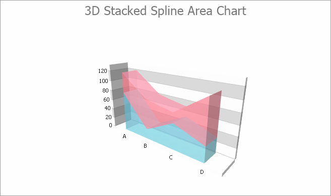

<!-- default badges list -->

<!-- default badges end -->
# 	Chart for WinForms - How to create a 3D Stacked Spline Area chart

The following example demonstrates how to create a [3D Stacked Spline Area](https://docs.devexpress.com/WindowsForms/3996/controls-and-libraries/chart-control/series-views/3d-series-views/area-series-views/stacked-spline-area-chart?p=netframework) chart at runtime.

Note that this series view type is associated with the [XY-Diagram 3D](https://docs.devexpress.com/WindowsForms/5909/controls-and-libraries/chart-control/diagram/xy-diagram-3d?p=netframework) type, and you should cast your [diagram](https://docs.devexpress.com/WindowsForms/5778/controls-and-libraries/chart-control/diagram?p=netframework) object to this type, in order to access its specific options.

## Files to Review

[Form1.cs](./CS/3DStackedSplineAreaChart/Form1.cs) (VB: [Form1.vb](./VB/3DStackedSplineAreaChart/Form1.vb))

## Documentation

[3D Stacked Spline Area](https://docs.devexpress.com/WindowsForms/3996/controls-and-libraries/chart-control/series-views/3d-series-views/area-series-views/stacked-spline-area-chart?p=netframework) 
